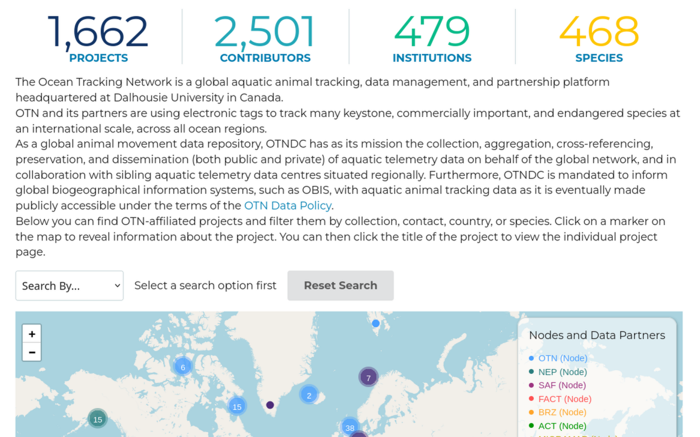

# otndata

`otndata` is a wrapper around the Ocean Tracking Network’s Plone content
management system setup. The [Ocean Tracking Network
(OTN)](https://members.oceantrack.org), [Atlantic Cooperative Telemetry
Network (ACT)](https://data.theactnetwork.com), [Pacific Islands Region
Acoustic Telemetry Network (PIRAT)](https://piratnetwork.org), and
[Northeast Pacific Acoustic Telemetry Network
(N-PACT)](https://plone.npact.aoos.org) are all nominally supported, but
some things might not work depending on the structure of the network and
the optional add-ins used. Because of this, [bug reports are really,
really, *really* appreciated](https://github.com/mhpob/otndata/issues)!!

## Installation

You can install the development version of otndata from
[GitHub](https://github.com/) with:

``` r

# install.packages("pak")
pak::pak("mhpob/otndata")
```

## Example

There are a few things that can be accessed without logging in. Most
nodes come pre-baked with a statistics widget and a project map:



Alternative text description

If this widget is enabled, you can access the information shown without
needing to log in.

``` r

library(otndata)

# OTN's server (default)
otn_list_species() |>
  head()
#>           scientificname           commonname
#> 1          Abramis brama         common bream
#> 2 Acanthocybium solandri                wahoo
#> 3    Acanthurus bahianus       cirujano pardo
#> 4     Acanthurus blochii ringtail surgeonfish
#> 5   Acanthurus chirurgus           doctorfish
#> 6   Acanthurus coeruleus            blue tang

# Try a different server
otn_list_projects(server = "act") |>
  head()
#>   node collectioncode country longitude latitude
#> 1  ACT        RUSHARK     USA  -73.8185  38.0705
#> 2  ACT          BTW1A     USA  -73.8150  38.0700
#> 3  ACT         REVCOD     USA  -73.8185  38.0705
#> 4  ACT      RAPPTRIBE     USA  -73.8185  38.0705
#> 5  ACT         RIWFCC     USA  -73.8185  38.0705
#> 6  ACT      INVENERGY     USA  -73.8185  38.0705
#>                                     shortname
#> 1                      RUCOOL HMS Shark Study
#> 2          BTWaves Caribbean Acoustic Tagging
#> 3                                  Orsted Cod
#> 4 Rappahannock Tribe Rappahannock River Array
#> 5  Narragansett Bay Cable Corridor Monitoring
#> 6                        Invenergy Monitoring
#>                                                                                                                              longname
#> 1 Investigating the movements and distribution of highly migratory shark species in the U.S. Northeast Shelf Large Marine Environment
#> 2                                                                                 Beneath the Waves acoustic tagging in the Caribbean
#> 3                                                                                                     Orsted Wind Farm Cod Monitoring
#> 4                                                                                                  Rappahannock River Telemetry Array
#> 5                                                                                Narragansett Bay Wind Farm Cable Corridor Monitoring
#> 6                                                                                                          Invenergy Whale Monitoring
#>         ocean                                                  website
#> 1 NW ATLANTIC                                                     <NA>
#> 2 NW ATLANTIC             https://www.beneaththewaves.org/initiatives/
#> 3 NW ATLANTIC                        https://rucool.marine.rutgers.edu
#> 4 NW ATLANTIC https://www.rappahannocktribe.org/environmentalservices/
#> 5 NW ATLANTIC                                                     <NA>
#> 6 NW ATLANTIC                        https://rucool.marine.rutgers.edu
#>   datacenter_infourl
#> 1                 NA
#> 2                 NA
#> 3                 NA
#> 4                 NA
#> 5                 NA
#> 6                 NA
#>                                                                     institutionname
#> 1                      Rutgers University Department of Marine and Coastal Sciences
#> 2                                Mid-Atlantic Acoustic Telemetry Observation System
#> 3                      Rutgers University Department of Marine and Coastal Sciences
#> 4                                                                Rappahannock Tribe
#> 5 Rhode Island Department of Environmental Management, Division of Marine Fisheries
#> 6                      Rutgers University Department of Marine and Coastal Sciences

otn_list_stats(server = "devel")
#> $project_count
#> [1] 1662
#> 
#> $contributor_count
#> [1] 2501
#> 
#> $inst_count
#> [1] 479
#> 
#> $species_count
#> [1] 468
#> 
#> $rcvr_count
#> [1] 2824
```

You can also query projects according to code, country of origin,
species, institution, node, or point of contact.

``` r

otn_search_node("ACT") |>
  head()
#>   node collectioncode country longitude latitude
#> 1  ACT        ASISEAL     USA  -73.8185  38.0705
#> 2  ACT         SBURAA     USA  -73.8185  38.0705
#> 3  ACT     WRWASTBASS     USA  -73.8185  38.0705
#> 4  ACT      WTGHABASS     USA  -73.8185  38.0705
#> 5  ACT       NCBONITO     USA  -73.8185  38.0705
#> 6  ACT          CT008     USA  -73.8185  38.0705
#>                                   shortname
#> 1 ASI - Seal Movement in New England Waters
#> 2                      SBU HRF Sturgeon RAA
#> 3                   WRWA/ SBI Striped Bass 
#> 4     WTGHA Menemsha Complex Striped Bass  
#> 5     NC Atlantic Bonito Tagging - NCSU/TNC
#> 6                 CT DEEP Array (2022-2026)
#>                                                                                                                      longname
#> 1 Understanding the movement ecology of rehabilitated seals in New England waters and potential interaction with white sharks
#> 2                Defining the ecological and conservation importance of the Rockaway Atlantic Sturgeon aggregation area (RAA)
#> 3                                             Initial assessment of seasonal fidelity of striped bass in the Westport River. 
#> 4                                                              Striped Bass Site Attachment and Habitat Use in Menemsha Pond 
#> 5                                                                Tracking coastwide movements of Atlantic bonito, Sarda sarda
#> 6                               CT DEEP array of VEMCO receivers in Long Island Sound and lower Connecticut River, 2022-2026.
#>         ocean                               website
#> 1 NW ATLANTIC http://www.atlanticsharkinstitute.org
#> 2 NW ATLANTIC                                  <NA>
#> 3 NW ATLANTIC                                  <NA>
#> 4 NW ATLANTIC                                  <NA>
#> 5 NW ATLANTIC                                  <NA>
#> 6 NW ATLANTIC                                  <NA>
#>              datacenter_infourl
#> 1 https://matos.asascience.com/
#> 2 https://matos.asascience.com/
#> 3 https://matos.asascience.com/
#> 4 https://matos.asascience.com/
#> 5 https://matos.asascience.com/
#> 6 https://matos.asascience.com/

# This accepts partial matches
otn_search_code("tail")
#>   node collectioncode country longitude latitude       shortname
#> 1  ACT      TAILWINDS     USA  -73.8185  38.0705 UMCES TailWinds
#>                                                                                longname
#> 1 TailWinds: Team for Assessing Impacts to Living resources from offshore WIND turbineS
#>         ocean                      website            datacenter_infourl
#> 1 NW ATLANTIC https://tailwinds.umces.edu/ https://matos.asascience.com/

# This does not accept partial matches
otn_search_contact("Mike O'Brien")
#>   node collectioncode country longitude latitude
#> 1  ACT       NAVYKENN     USA  -69.7800  43.7750
#> 2  ACT         CBBBMB     USA  -73.8150  38.0700
#> 3  ACT      TAILWINDS     USA  -73.8185  38.0705
#> 4  ACT         MAMBON     USA  -73.8185  38.0705
#>                            shortname
#> 1   Navy Kennebec ME Telemetry Array
#> 2 UMCES Chesapeake Backbone, Mid-Bay
#> 3                    UMCES TailWinds
#> 4                  Mid-Atlantic MBON
#>                                                                                         longname
#> 1 Naval Undersea Warfare Center (NUWC) Kennebec River and Offshore Acoustic Telemetry Monitoring
#> 2                            Building a Mainstem Chesapeake Bay Telemetry Array: Mid-Bay Segment
#> 3          TailWinds: Team for Assessing Impacts to Living resources from offshore WIND turbineS
#> 4                Mid-Atlantic MBON: Dynamic Biodiversity and Telemetry Data for a Changing Coast
#>         ocean                                          website
#> 1 NW ATLANTIC                                             <NA>
#> 2 NW ATLANTIC                                             <NA>
#> 3 NW ATLANTIC                     https://tailwinds.umces.edu/
#> 4 NW ATLANTIC https://marinebon.org/us-mbon/mid-atlantic-mbon/
#>              datacenter_infourl
#> 1 https://matos.asascience.com/
#> 2 https://matos.asascience.com/
#> 3 https://matos.asascience.com/
#> 4 https://matos.asascience.com/
```

You’ll likely need to log in to access other parts of the CMS. You can
set your username and password for your system using the
`otn_set_credentials` helper function.

``` r

otn_set_credentials()
```

After that, you can just log in using `otn_login`. This package is meant
to interface with any node’s Plone instance. You can switch between them
using the `server` argument.

``` r

otn_login(server = 'act')
#> ✔ Login successful!
```

List your project’s files:

``` r

otn_project_files(project = 'tailwinds', server = 'act', batch_size = 5)
#>                                            name description
#> 1        tailwinds_master_metadata_20240812.csv            
#> 2     tailwinds_metadata_deployment_202411.xlsx            
#> 3        tailwinds_otn_metadata_deployment.xlsx            
#> 4 tailwinds_otn_metadata_deployment_202404.xlsx            
#> 5                   VR2AR_546307_20240425_1.vrl            
#>                                                                                                                                          url
#> 1        https://data.theactnetwork.com/data/repository/tailwinds/data-and-metadata/receiver-metadata/tailwinds_master_metadata_20240812.csv
#> 2     https://data.theactnetwork.com/data/repository/tailwinds/data-and-metadata/receiver-metadata/tailwinds_metadata_deployment_202411.xlsx
#> 3        https://data.theactnetwork.com/data/repository/tailwinds/data-and-metadata/receiver-metadata/tailwinds_otn_metadata_deployment.xlsx
#> 4 https://data.theactnetwork.com/data/repository/tailwinds/data-and-metadata/receiver-metadata/tailwinds_otn_metadata_deployment_202404.xlsx
#> 5                     https://data.theactnetwork.com/data/repository/tailwinds/data-and-metadata/detection-files/vr2ar_546307_20240425_1.vrl
#>               created            modified creator     size type
#> 1 2026-06-10 03:51:32 2026-06-10 03:51:32 krichie   2.5 KB File
#> 2 2026-06-10 03:51:58 2026-06-10 03:51:58 krichie  41.9 KB File
#> 3 2026-06-10 03:52:17 2026-06-10 03:52:17 krichie  37.0 KB File
#> 4 2026-06-10 03:52:30 2026-06-10 03:52:30 krichie  36.7 KB File
#> 5 2026-06-10 03:55:34 2026-06-10 03:55:34 krichie 751.0 KB File

otn_extract_files(project = 'tailwinds', server = 'act', batch_size = 5)
#>                                            name description
#> 1   tailwinds_qualified_detections_2023.parquet            
#> 2       tailwinds_qualified_detections_2023.zip            
#> 3   tailwinds_qualified_detections_2024.parquet            
#> 4       tailwinds_qualified_detections_2024.zip            
#> 5 tailwinds_unqualified_detections_2023.parquet            
#>                                                                                                                         url
#> 1   https://data.theactnetwork.com/data/repository/tailwinds/detection-extracts/tailwinds_qualified_detections_2023-parquet
#> 2       https://data.theactnetwork.com/data/repository/tailwinds/detection-extracts/tailwinds_qualified_detections_2023.zip
#> 3   https://data.theactnetwork.com/data/repository/tailwinds/detection-extracts/tailwinds_qualified_detections_2024-parquet
#> 4       https://data.theactnetwork.com/data/repository/tailwinds/detection-extracts/tailwinds_qualified_detections_2024.zip
#> 5 https://data.theactnetwork.com/data/repository/tailwinds/detection-extracts/tailwinds_unqualified_detections_2023-parquet
#>               created            modified creator     size type
#> 1 2026-06-12 13:25:31 2026-06-12 13:25:31 krichie 133.0 KB File
#> 2 2026-06-12 13:25:49 2026-06-12 13:25:50 krichie  95.6 KB File
#> 3 2026-06-12 13:26:03 2026-06-12 13:26:03 krichie 174.2 KB File
#> 4 2026-06-12 13:26:19 2026-06-12 13:26:19 krichie 129.7 KB File
#> 5 2026-06-12 13:26:33 2026-06-12 13:26:33 krichie 602.3 KB File
```

Or, just grab the ones modified more recently using the `since`
argument:

``` r

otn_project_files(
  project = 'tailwinds',
  since = "2026-06-01",
  server = 'act',
  batch_size = 5
)
#>                                            name description
#> 1        tailwinds_master_metadata_20240812.csv            
#> 2     tailwinds_metadata_deployment_202411.xlsx            
#> 3        tailwinds_otn_metadata_deployment.xlsx            
#> 4 tailwinds_otn_metadata_deployment_202404.xlsx            
#> 5                   VR2AR_546307_20240425_1.vrl            
#>                                                                                                                                          url
#> 1        https://data.theactnetwork.com/data/repository/tailwinds/data-and-metadata/receiver-metadata/tailwinds_master_metadata_20240812.csv
#> 2     https://data.theactnetwork.com/data/repository/tailwinds/data-and-metadata/receiver-metadata/tailwinds_metadata_deployment_202411.xlsx
#> 3        https://data.theactnetwork.com/data/repository/tailwinds/data-and-metadata/receiver-metadata/tailwinds_otn_metadata_deployment.xlsx
#> 4 https://data.theactnetwork.com/data/repository/tailwinds/data-and-metadata/receiver-metadata/tailwinds_otn_metadata_deployment_202404.xlsx
#> 5                     https://data.theactnetwork.com/data/repository/tailwinds/data-and-metadata/detection-files/vr2ar_546307_20240425_1.vrl
#>               created            modified creator     size type
#> 1 2026-06-10 03:51:32 2026-06-10 03:51:32 krichie   2.5 KB File
#> 2 2026-06-10 03:51:58 2026-06-10 03:51:58 krichie  41.9 KB File
#> 3 2026-06-10 03:52:17 2026-06-10 03:52:17 krichie  37.0 KB File
#> 4 2026-06-10 03:52:30 2026-06-10 03:52:30 krichie  36.7 KB File
#> 5 2026-06-10 03:55:34 2026-06-10 03:55:34 krichie 751.0 KB File

otn_extract_files(
  project = 'tailwinds',
  since = "2026-06-01",
  server = 'act',
  batch_size = 5
)
#>                                            name description
#> 1   tailwinds_qualified_detections_2023.parquet            
#> 2       tailwinds_qualified_detections_2023.zip            
#> 3   tailwinds_qualified_detections_2024.parquet            
#> 4       tailwinds_qualified_detections_2024.zip            
#> 5 tailwinds_unqualified_detections_2023.parquet            
#>                                                                                                                         url
#> 1   https://data.theactnetwork.com/data/repository/tailwinds/detection-extracts/tailwinds_qualified_detections_2023-parquet
#> 2       https://data.theactnetwork.com/data/repository/tailwinds/detection-extracts/tailwinds_qualified_detections_2023.zip
#> 3   https://data.theactnetwork.com/data/repository/tailwinds/detection-extracts/tailwinds_qualified_detections_2024-parquet
#> 4       https://data.theactnetwork.com/data/repository/tailwinds/detection-extracts/tailwinds_qualified_detections_2024.zip
#> 5 https://data.theactnetwork.com/data/repository/tailwinds/detection-extracts/tailwinds_unqualified_detections_2023-parquet
#>               created            modified creator     size type
#> 1 2026-06-12 13:25:31 2026-06-12 13:25:31 krichie 133.0 KB File
#> 2 2026-06-12 13:25:49 2026-06-12 13:25:50 krichie  95.6 KB File
#> 3 2026-06-12 13:26:03 2026-06-12 13:26:03 krichie 174.2 KB File
#> 4 2026-06-12 13:26:19 2026-06-12 13:26:19 krichie 129.7 KB File
#> 5 2026-06-12 13:26:33 2026-06-12 13:26:33 krichie 602.3 KB File
```

You can download a file via its URL. This is a BIG work in progress and
the API will likely change multiple times in the coming weeks.

``` r

otn_get_file(
  "https://members.devel.oceantrack.org/data/repository/nsbs/detection-extracts/nsbs_matched_detections_2017.zip"
)
```
